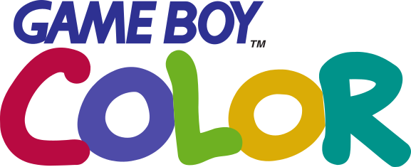
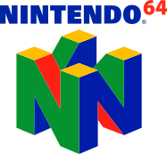
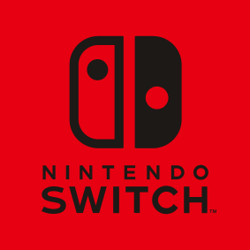
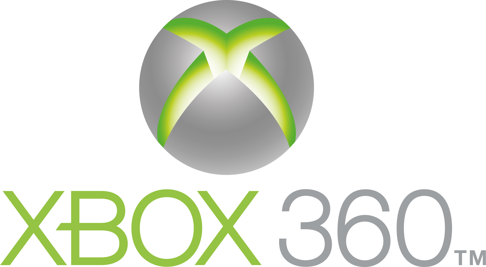

# PK Game Archive — Complete

> **1246** titles · every platform experienced · updated 2026-07-27.

## Platforms

| Platform | Titles |
| --- | ---: |
| **[Game Boy](#game-boy)**  | 35 |
| **[Game Boy Advance](#game-boy-advance)**  | 39 |
| **[Game Boy Color](#game-boy-color)**  | 26 |
| **[GameCube](#gamecube)**  | 46 |
| **[NES](#nes)**  | 42 |
| **[Nintendo 64](#nintendo-64)**  | 40 |
| **[Nintendo DS](#nintendo-ds)**  | 12 |
| **[PlayStation 2](#playstation-2)**  | 114 |
| **[PlayStation 3](#playstation-3)**  | 29 |
| **[PlayStation 4](#playstation-4)**  | 150 |
| **[PlayStation 5](#playstation-5)** | 5 |
| **[SNES](#snes)**  | 56 |
| **[Nintendo Switch](#nintendo-switch)**  | 14 |
| **[Wii](#wii)**  | 22 |
| **[Wii U](#wii-u)**  | 16 |
| **[Xbox 360](#xbox-360)**  | 103 |
| **[Xbox One](#xbox-one)**  | 175 |
| **[PC](#pc)**  | 322 |

---

## Game Boy 

`35 titles`

- Adventure Island
- Adventure Island II: Aliens in Paradise
- Aladdin
- Battletoads
- Bomberman GB
- Castlevania II: Belmont's Revenge
- Castlevania Legends
- Castlevania: The Adventure
- Contra: The Alien Wars
- Donkey Kong
- Dr. Mario
- DuckTales
- Game & Watch Gallery
- Golf
- Kirby's Dream Land
- Kirby's Dream Land 2
- Mega Man II
- Mega Man III
- Mega Man IV
- Mega Man V
- Mega Man: Dr. Wily's Revenge
- Mortal Kombat
- Mortal Kombat II
- Ninja Gaiden Shadow
- Pac-Man
- Pokemon: Blue Version
- Pokemon: Red Version
- Pokemon: Yellow Version: Special Pikachu
- Super Mario Land
- Tennis
- Tetris
- The Amazing Spider-Man
- The Legend of Zelda: Link's Awakening
- Yoshi
- Yoshi's Cookie

## Game Boy Advance 

`39 titles`

- Aladdin
- Alien Hominid
- Banjo-Kazooie: Grunty's Revenge
- Bomberman Tournament
- Castlevania: Aria of Sorrow
- Castlevania: Circle of the Moon
- Castlevania: Harmony of Dissonance
- Crash Bandicoot 2: N-Tranced
- Crash Bandicoot: The Huge Adventure
- Deal or No Deal
- Donkey Kong Country
- Donkey Kong Country 2
- Donkey Kong Country 3
- Doom
- Doom II
- Duke Nukem Advance
- Lara Croft Tomb Raider: The Prophecy
- Mario & Luigi: Superstar Saga
- Mario Golf: Advance Tour
- Mario Kart: Super Circuit
- Mario Party Advance
- Mario vs. Donkey Kong
- Max Payne
- Mega Man Zero
- Mega Man Zero 2
- Mega Man Zero 3
- Mega Man Zero 4
- Metal Slug Advance
- Metroid: Zero Mission
- Pokemon Mystery Dungeon: Red Rescue Team
- Pokemon Pinball: Ruby & Sapphire
- Pokemon: Emerald Version
- Pokemon: FireRed Version
- Pokemon: LeafGreen Version
- Pokemon: Ruby Version
- Pokemon: Sapphire Version
- Sonic The Hedgehog: Genesis
- The Legend of Zelda: A Link to the Past & Four Swords
- The Legend of Zelda: The Minish Cap

## Game Boy Color 

`26 titles`

- Dance Dance Revolution GB
- Dance Dance Revolution GB: Disney Mix
- Donkey Kong Country
- Frogger
- Game & Watch Gallery 2
- Ghosts'n Goblins
- Harvest Moon 2 GBC
- Harvest Moon GB
- Mario Golf
- Mario Tennis
- Mega Man Xtreme
- Mega Man Xtreme 2
- Pokemon Pinball
- Pokemon Puzzle Challenge
- Pokemon Trading Card Game
- Pokemon: Crystal Version
- Pokemon: Gold Version
- Pokemon: Silver Version
- Rayman
- Super Mario Bros.
- The Legend of Zelda: Oracle of Ages
- The Legend of Zelda: Oracle of Seasons
- Uno
- Who Wants to Be a Millionaire: 2nd
- Xtreme Sports
- Yu-Gi-Oh!: Dark Duel Stories

## GameCube 

`46 titles`

- Animal Crossing
- Burnout
- Burnout 2: Point of Impact
- Crazy Taxi
- Curious George
- Dance Dance Revolution: Mario Mix
- Fantastic 4
- Finding Nemo
- Jimmy Neutron: Boy Genius
- Looney Tunes: Back in Action
- Luigi's Mansion
- Mario Golf: Toadstool Tour
- Mario Kart: Double Dash!!
- Mario Party 4
- Mario Party 5
- Mario Party 6
- Mario Party 7
- Mario Power Tennis
- Mario Superstar Baseball
- Mortal Kombat: Deadly Alliance
- Mortal Kombat: Deception
- Nicktoons Unite!
- Open Season
- Outlaw Golf
- Pac-Man Fever
- Pac-Man Vs.
- Paper Mario: The Thousand-Year Door
- Pikmin
- Pikmin 2
- Pitfall: The Lost Exp
- Pixar: Cars
- SpongeBob SquarePants in: Battle for Bikini Bottom
- SpongeBob SquarePants: The Movie
- Super Mario Strikers
- Super Mario Sunshine
- Super Monkey Ball
- Super Smash Bros. Melee
- Teen Titans
- The Incredibles
- The Incredibles: Rise of the Underminer
- The Legend of Zelda: Ocarina of Time & Master Quest
- The Legend of Zelda: The Wind Waker
- The Simpsons: Hit & Run
- Wallace & Gromit in Project Zoo
- Wario World
- WarioWare, Inc.: Mega Party Game$!

## NES 

`42 titles`

- Castlevania
- Castlevania II: Simon's Quest
- Castlevania III: Dracula's Curse
- Championship Bowling
- Commando
- Contra
- Donkey Kong
- Donkey Kong 3
- Donkey Kong Jr.
- Dr. Mario
- Ghosts'n Goblins
- Golf
- Home Alone
- Home Alone 2: Lost in New York
- Jeopardy!
- Lemmings
- Mario Bros.
- Mega Man
- Mega Man 2
- Mega Man 3
- Mega Man 4
- Mega Man 5
- Mega Man 6
- Metal Gear
- Metroid
- Mike Tyson's Punch-Out!!
- Pac-Man (Namco)
- Paperboy
- Prince of Persia
- Spy vs Spy
- Super Dodge Ball
- Super Mario Bros.
- Super Mario Bros. 2
- Super Mario Bros. 3
- Tennis
- Tetris
- Tetris 2
- The Legend of Zelda
- Where's Waldo
- Yoshi
- Yoshi's Cookie
- Zelda II: The Adventure of Link

## Nintendo 64 

`40 titles`

- 007: GoldenEye
- Banjo-Kazooie
- Banjo-Tooie
- Bomberman 64
- Bomberman 64: The Second Attack!
- Conker's Bad Fur Day
- Diddy Kong Racing
- Donkey Kong 64
- Doom 64
- Duke Nukem 64
- F-Zero X
- Harvest Moon 64
- Mario Golf
- Mario Kart 64
- Mario Party
- Mario Party 2
- Mario Party 3
- Mario Tennis
- Mortal Kombat 4
- Mortal Kombat Trilogy
- NBA Jam 2000
- NBA Jam 99
- Paper Mario
- Perfect Dark
- Pokemon Puzzle League
- Pokemon Snap
- Pokemon Stadium
- Pokemon Stadium 2
- Road Rash 64
- South Park
- Star Fox 64
- StarCraft 64
- Super Mario 64
- Super Smash Bros.
- The Legend of Zelda: Majora's Mask
- The Legend of Zelda: Ocarina of Time
- Tigger's Honey Hunt
- Tony Hawk's Pro Skater
- Tony Hawk's Pro Skater 2
- Tony Hawk's Pro Skater 3

## Nintendo DS 

`12 titles`

- Pokemon Black
- Pokemon Black 2
- Pokemon Conquest
- Pokemon Dash
- Pokemon Diamond
- Pokemon Heart
- Pokemon Pearl
- Pokemon Platinum
- Pokemon Ranger
- Pokemon SoulSilver
- Pokemon White
- Pokemon White 2

## PlayStation 2 

`114 titles`

- Beyond Good & Evil
- Black
- Blitz: The League
- Bully
- Burnout
- Burnout 2: Point of Impact
- Burnout 3: Takedown
- Burnout Dominator
- Burnout Revenge
- Clock Tower 3
- Crash Bandicoot: The Wrath of Cortex
- Crash Nitro Kart
- Crash of the Titans
- Crash Tag Team Racing
- Crash Twinsanity
- Crash: Mind over Mutant
- Dance Dance Revolution Extreme
- Dead to Rights
- Dead to Rights II
- Devil May Cry
- Devil May Cry 2
- Devil May Cry 3: Dante's Awakening (Special Edition)
- Disney-Pixar Ratatouille
- DreamWorks Bee Movie Game
- DreamWorks Madagascar
- DreamWorks Over the Hedge
- Enter the Matrix
- Futurama
- Gauntlet: Dark Legacy
- Ghostbusters: The Video Game
- God Hand
- God of War
- God of War II
- Gran Turismo 4
- Grand Theft Auto: Liberty City Stories
- Grand Theft Auto: San Andreas
- Grand Theft Auto: Vice City
- Grand Theft Auto: Vice City Stories
- Guitar Hero
- Guitar Hero II
- Guitar Hero III: Legends of Rock
- Harry Potter and the Half-Blood Prince
- Harry Potter and the Prisoner of Azkaban
- Harry Potter and the Sorcerer's Stone
- Jackass: The Game
- Jak 3
- Jak and Daxter: The Precursor Legacy
- Jak II
- Just Cause
- Killzone
- Kingdom Hearts II: Final Mix (English Patch)
- Kingdom Hearts: Final Mix (English Patch)
- LEGO Batman: The Videogame
- LEGO Indiana Jones: The Original Adventures
- LEGO Star Wars II: The Original Trilogy
- LEGO Star Wars: The Video Game
- Manhunt
- Mega Man X
- Mercenaries 2: World in Flames
- Metal Gear Solid 2: Substance
- Metal Gear Solid 3: Subsistence
- Metal Slug Anthology
- Midnight Club 3: DUB Edition Remix
- Mortal Kombat: Armageddon (Premium Edition)
- Mortal Kombat: Deadly Alliance
- Mortal Kombat: Deception
- Mortal Kombat: Shaolin Monks
- Need for Speed: Carbon
- Need for Speed: Hot Pursuit 2
- Need for Speed: Most Wanted: Black
- Need for Speed: ProStreet
- Need for Speed: Underground
- Open Season
- Pac-Man World 2
- PaRappa the Rapper 2
- Prince of Persia: The Sands of Time
- Prince of Persia: Warrior Within
- Ratchet & Clank
- Ratchet & Clank: Going Commando
- Ratchet & Clank: Up Your Arsenal
- Ratchet: Deadlocked
- Resident Evil 4
- Shadow of the Colossus
- Shrek 2
- Silent Hill 2
- Silent Hill 3
- Silent Hill 4: The Room
- Sly 2: Band of Thieves
- Spider-Man
- Spider-Man 2
- Spider-Man 3
- SpongeBob SquarePants: Battle for Bikini Bottom
- SpongeBob SquarePants: The Movie
- SpongeBob's Atlantis SquarePantis
- Spyro: A Hero's Tail
- Spyro: Enter the Dragonfly
- SSX 3
- SSX Tricky
- Tekken 4
- Tekken 5
- The Incredible Hulk
- The Legend of Spyro: A New Beginning
- The Legend of Spyro: Dawn of the Dragon
- The Legend of Spyro: The Eternal Night
- The Matrix: Path of Neo
- The Punisher
- The Simpsons: Hit & Run
- The Sims 2
- TimeSplitters 2
- Tomb Raider: Anniversary
- Tomb Raider: The Angel of Darkness
- Transformers: The Game
- Ultimate Spider-Man
- WWE SmackDown vs. Raw 2011

## PlayStation 3 

`29 titles`

- Army of Two
- Army of Two: The 40th Day
- Army of Two: The Devil's Cartel
- Blitz: The League II
- Dead to Rights: Retribution
- Deadliest Warrior: Ancient Combat
- God of War III
- God of War: Ascension
- God of War: Chains of Olympus
- God of War: Ghost of Sparta
- inFamous
- inFamous 2
- LittleBigPlanet 3
- Midnight Club: Los Angeles
- Mortal Kombat vs. DC Universe
- Ratchet & Clank Future: A Crack in Time
- Ratchet & Clank Future: Tools of Destruction
- Ratchet & Clank: All 4 One
- Ratchet & Clank: Full Frontal Assault
- Ratchet & Clank: Into the Nexus
- Simpsons The Game
- Skate 3
- Spider-Man 3
- Splatterhouse
- SSX
- The Amazing Spider-Man 2
- Uncharted 2: Among Thieves
- Uncharted 3: Drakes Deception
- Uncharted: Drakes Fortune

## PlayStation 4 

`150 titles`

- ABZU
- Adventure Time: Pirates of the Enchiridion
- Apex Legends
- Assassin's Creed III
- Battlefield 4
- Battlefield Hardline
- biohazard 4
- BIOHAZARD 6
- BIOHAZARD 7 resident evil
- BIOHAZARD 7 TEASER - BEGINNING HOUR
- BIOHAZARD RE:2
- BIOHAZARD RE:2 Z Version
- BIOHAZARD UMBRELLA CORPS
- BIOHAZARD5
- Blacklight: Retribution
- Bloodborne
- Bloodborne The Old Hunters
- Borderlands 3
- Borderlands: The Handsome
- Brawlhalla
- Broforce
- Brothers : a Tale of Two Sons
- Bully
- Call of Duty: Black Ops III
- Call of Duty: Modern Warfare
- Call of Duty: Modern Warfare 2
- Castle Crashers
- Castle Invasion: Throne Out
- Clicker Heroes
- Control
- CounterSpy
- Cuisine Royale
- Cuphead
- DARK SOULS
- DARK SOULS II
- DARK SOULS III
- Dead by Daylight
- DEAD OR ALIVE 5 Last Round
- Destiny 2
- Devil May Cry 5
- DOOM
- DRAGON BALL FighterZ
- DRAGON BALL XENOVERSE
- DRAGON BALL XENOVERSE 2
- Dying Light
- Dying Light: The Following
- EA SPORTS UFC 3
- Escape Plan
- Ether One
- Fall Guys: Ultimate Knockout
- Fallout 4
- Far Cry 3 Classic
- Far Cry 5
- FFXV
- FINAL FANTASY XV
- For Honor
- Fortnite
- Friday the 13th: The Game
- Gems of War
- Goat Simulator
- God of War
- Grand Theft Auto 3
- Grand Theft Auto V
- Grand Theft Auto: San Andreas
- Grand Theft Auto: Vice City
- GUNS UP!
- Hollow Knight
- Horizon Zero Dawn
- Hotline Miami 2: Wrong Number
- inFAMOUS First Light
- inFAMOUS Second Son
- Injustice 2
- Jak 3
- Jak and Daxter
- Jak and Daxter: The Precursor Legacy
- Jak II
- JUMP FORCE
- Jurassic World Evolution
- Just Cause 4
- Killing Floor 2
- Kingdom: New Lands
- LEGO Harry Potter
- LET IT DIE
- Life Is Strange
- Little Nightmares
- Madden NFL 20
- Marvel's Spider-Man
- METAL GEAR SOLID V: GROUND ZEROES
- Minecraft
- MLB The Show 19
- MLB The Show 20
- Mortal Kombat 11
- Mortal Kombat X
- Mortal Kombat XL
- NARUTO SHIPPUDEN: Ultimate Ninja STORM 4
- NBA 2K19
- NBA 2K20
- NBA 2K21
- Need for Speed Payback
- Need for Speed Rivals
- Never Alone
- Neverwinter
- Oddworld: New 'n' Tasty
- OlliOlli2: Welcome to Olliwood
- Operation Tango
- Overwatch: Origins
- PlanetSide 2
- Primal Carnage: Extinction
- Ratchet & Clank
- Rayman Legends
- RealFarm
- Red Dead Redemption 2
- RESIDENT EVIL 2
- resident evil 4 (2005)
- RESIDENT EVIL 6
- RESIDENT EVIL 7 biohazard
- RESIDENT EVIL UMBRELLA CORPS
- RESIDENT EVIL5
- Rocket League
- Scribblenauts Mega Pack
- Shadow of the Tomb Raider
- Skulls of the Shogun
- Slime Rancher
- Sniper Elite 3
- Spelunky
- Splitgate
- Spyro Reignited Trilogy
- STAR WARS Battlefront II
- STAR WARS Jedi: Fallen Order
- Stranded Deep
- STREET FIGHTER V
- Super Mega Baseball
- SUPERHOT
- Team Sonic Racing
- TEKKEN7
- Terraria
- The Binding of Isaac: Afterbirth+
- The Binding of Isaac: Rebirth
- The Last Guardian
- The Last of Us
- The Red Door
- The Sims 4
- UMBRELLA CORPS
- Uncharted 4: A Thief's End
- Uncharted: The Lost Legacy
- Undertale
- War Thunder
- Warface
- Warframe
- WATCH_DOGS 2

## PlayStation 5

`5 titles`

- ASTRO's PLAYROOM
- Call of Duty: Black Ops Cold War
- Control
- Horizon Zero Dawn
- NBA 2K21

## SNES 

`56 titles`

- Aladdin
- Battletoads in Battlemaniacs
- Battletoads-Double Dragon
- Castlevania: Dracula X
- Chrono Trigger
- Clue
- Contra III: The Alien Wars
- Donkey Kong Country
- Donkey Kong Country 2: Diddy's Kong Quest
- Donkey Kong Country 3: Dixie Kong's Double Trouble!
- Doom
- Earthworm Jim
- Earthworm Jim 2
- F-Zero
- Fatal Fury
- Fatal Fury 2
- Fatal Fury Special
- Final Fantasy II
- Final Fantasy III
- Final Fantasy: Mystic Quest
- Frogger
- Kirby's Dream Course
- Lemmings
- Lemmings 2: The Tribes
- Mega Man 7
- Mega Man X
- Mega Man X2
- Mega Man X3
- Monopoly
- Mortal Kombat
- Mortal Kombat 3
- Mortal Kombat II
- Ms. Pac-Man
- NBA Jam
- NBA Jam: Tournament
- Pac-Man 2: The New Adventures
- SimCity
- Star Fox
- Star Fox 2
- Street Fighter II Turbo
- Super Adventure Island
- Super Adventure Island II
- Super Mario All-Stars
- Super Mario Kart
- Super Mario RPG: Legend of the Seven Stars
- Super Mario World
- Super Mario World 2: Yoshi's Island
- Super Punch-Out!!
- Super Tennis
- Tetris 2
- The Legend of Zelda: A Link to the Past
- The Lion King
- Toy Story
- Wolfenstein 3-D
- Yoshi's Cookie
- Yoshi's Safari

## Nintendo Switch 

`14 titles`

- Luigis Mansion 2
- Luigi’s Mansion 3
- Mario Golf Super Rush
- Mario Party Superstars
- Mario Tennis Aces
- Paper Mario The Origami King
- Super Mario 3D All-Stars
- Super Mario 3D World Bowsers Fury
- Super Mario Bros. Wonder
- Super Mario Odyssey
- Super Mario Party
- Super Mario Party Jamboree
- Super Smash Bros
- The Legend of Zelda Tears of the Kingdom

## Wii 

`22 titles`

- Donkey Kong Country Returns
- Harry Potter and the Deathly Hallows: Part 1
- Harry Potter and the Deathly Hallows: Part 2
- Harry Potter and the Half-Blood Prince
- Harry Potter and the Order of the Phoenix
- Mario Kart Wii
- Mario Party 8
- Mario Party 9
- Mario Power Tennis
- Mario Sports Mii
- Mario Strikers Charged
- Mario Super Sluggers
- MLB Power Pros 2008
- Mortal Kombat: Armageddon
- Pirates vs Ninjas Dodgeball
- Punch-Out!!
- Super Mario All-Stars
- Super Mario Bros. 3+
- Super Mario Galaxy
- Super Mario Galaxy 2
- Super Paper Mario
- Super Smash Bros. Brawl

## Wii U 

`16 titles`

- Bayonetta
- Bayonetta 2
- Captain Toad: Treasure Tracker
- Donkey Kong Country: Tropical Freeze
- Kirby and the Rainbow Curse
- Mario Kart 8
- Mario Party 10
- New Super Mario Bros. U + New Super Luigi U
- Paper Mario: Color Splash
- Pikmin 3
- Sonic Boom: Rise of Lyric
- Super Mario 3D World
- Super Smash Bros. for Wii U
- The Legend of Zelda: Breath of the Wild
- The Legend of Zelda: The Wind Waker
- Yoshi's Woolly World

## Xbox 360 

`103 titles`

- A World of Keflings
- Alien Hominid
- Assassin's Creed
- Assassin's Creed II
- Assassin's Creed III
- BattleBlock Theater
- Battlefield 4
- Battlefield: Bad Company 2
- Call of Duty: Advanced Warfare
- Call of Duty: Black Ops II
- Call of Duty: Ghosts
- Call of Duty: Modern Warfare 2
- Call of Duty: Modern Warfare 3
- Castle Crashers
- Crackdown
- Crysis 3
- Dance Central
- Dance Central 2
- Dark Souls
- Darksiders II
- Dead Island
- Deadliest Warrior
- Devil May Cry
- Disney Universe
- DJ Hero 2
- Doritos Crash Course 2
- Dungeon Defenders
- Enslaved: Odyssey to the West
- Fallout 3
- Fallout: New Vegas
- Far Cry 3
- Far Cry 4
- Forza Horizon
- Forza Horizon 2
- Forza Motorsport 2
- Forza Motorsport 3
- Forza Motorsport 4
- Gears of War
- Gears of War 2
- Gears of War 3
- Gears of War: Judgment
- Grand Theft Auto V
- Guitar Hero III: Legends of Rock
- Halo 3
- Halo 3: ODST
- Halo 4
- Halo Wars
- Halo: Reach
- Happy Wars
- Heavy Weapon
- How to Survive
- Injustice: Gods Among Us
- Iron Brigade
- Kameo: Elements of Power
- Kinect Adventures!
- Kinectimals
- Kingdoms of Amalur: Reckoning
- Left 4 Dead 2
- LEGO Batman 2: DC Super Heroes
- LEGO Harry Potter: Years 1–4
- LEGO Harry Potter: Years 5–7
- LEGO Indiana Jones 2: The Adventure Continues
- LEGO Star Wars III: The Clone Wars
- LEGO Star Wars: The Complete Saga
- Life is Strange
- Marvel Ultimate Alliance 2
- Marvel vs. Capcom 3: Fate of Two Worlds
- Minecraft
- Mini Ninjas
- Mortal Kombat
- Mortal Kombat vs. DC Universe
- Need for Speed: Hot Pursuit
- Plants vs. Zombies
- Portal 2
- Prototype
- Prototype 2
- Quantum Conundrum
- Rayman Legends
- Real Steel
- Rock of Ages
- Saints Row: The Third
- Scott Pilgrim vs. the World: The Game
- Shoot Many Robots
- Skate 3
- Sleeping Dogs
- Soulcalibur IV
- Spartacus Legends
- Spelunky
- SSX
- Star Wars: The Force Unleashed II
- State of Decay
- Tekken 6
- Terraria
- The Orange Box
- The Simpsons Game
- The Sims 3: Pets
- The Walking Dead
- Thief
- Tom Clancy's Rainbow Six Vegas
- Toy Story 3
- UFC Undisputed 2010
- Watch Dogs
- Worms 2: Armageddon

## Xbox One 

`175 titles`

- #IDARB
- 7 Days to Die
- A Way Out
- A World of Keflings
- ACA NEOGEO METAL SLUG X
- AirMech Arena
- Alien Hominid
- APB Reloaded
- ARK: Survival Evolved
- Assassin's Creed
- Assassin's Creed II
- Assassin's Creed III
- Assassin's Creed IV Black Flag
- Assassin's Creed Unity
- Batman: Arkham City
- BattleBlock Theater
- Battlefield Bad Company 2
- Blair Witch
- Borderlands 2
- Borderlands: The Pre-Sequel
- Call of Duty: Advanced Warfare
- Call of Duty: Black Ops III
- Call of Duty: Ghosts
- Call of Duty: Modern Warfare
- Castle Crashers
- COD: Advanced Warfare
- COD: Black Ops II
- Crackdown
- Crackdown 3
- Crossout
- Crysis 3
- Dark Souls
- DARK SOULS II
- Darksiders II
- Darksiders III
- Dead Island
- Dead Rising 4
- Deadliest Warrior
- Destiny
- Devil May Cry 4: Special
- Devil May Cry 5
- Dishonored 2
- Disney Universe
- Donut County
- DOOM
- DOOM Eternal (BATTLEMODE - PC)
- Doritos Crash Course
- Dragon Ball: Xenoverse
- Enslaved
- Fallout 3
- Fallout: New Vegas
- Far Cry 3
- Firewatch
- Five Nights at Freddy's
- Five Nights at Freddy's 2
- Fortnite
- Forza Horizon 2 Presents Fast & Furious
- Forza Horizon 4
- Forza Horizon 5
- Frogger
- Gears 5
- Gears of War
- Gears of War 2
- Gears of War 3
- Gears of War 4
- Gears of War: Judgment
- Goat Simulator
- Golf With Your Friends
- Grand Theft Auto V
- Halo 3
- Halo 3: ODST Campaign
- Halo 4
- Halo Infinite
- Halo Wars
- Halo: Reach
- Halo: The Master Chief
- Happy Wars
- Harms Way
- Heavy Weapon
- Hexic
- Hitman
- I Am Alive
- Injustice 2
- Injustice: Gods Among Us
- Iron Brigade
- JUMP FORCE
- Just Cause 4
- Kameo
- Killer Instinct
- Kingdom Come: Deliverance
- Kingdoms of Amalur: Reckoning
- Left 4 Dead 2
- LEGO Batman 2
- LEGO Indiana Jones 2
- LEGO Pirates of the Caribbean: The Video Game
- LEGO Star Wars III
- LEGO Star Wars: TCS
- Life is Strange 2 Episode 1
- Madden NFL 16
- Madden NFL 19
- Marvel vs. Capcom: Infinite
- Meet the Robinsons
- Metal Gear Solid V: Ground Zeroes
- Metal Gear Solid V: The Phantom Pain
- Middle-earth: Shadow of War
- Minecraft
- Minecraft Launcher
- MINI NINJAS
- Modern Warfare 2
- Modern Warfare 3
- Mortal Kombat
- Mortal Kombat vs. DCU
- Mortal Kombat X
- Motocross Madness
- Moving Out
- NBA 2K19
- NBA 2K20
- NBA 2K21
- NBA Live 15
- Need for Speed Heat
- Neverwinter
- Ori and the Blind Forest
- Outlast
- Oxenfree
- Plants vs. Zombies
- Pneuma: Breath of Life
- Portal 2
- Project Spark
- Prototype
- Quantum Conundrum
- Rainbow Six Siege
- Rare Replay
- Rayman Legends
- Rayman Origins
- Red Dead Redemption 2
- Resident Evil 4
- Roblox
- Rock of Ages
- Rocket League
- Saints Row: The Third
- Sea of Thieves
- Skate 3
- Slender: The Arrival
- Slime Rancher
- Sniper Elite 4
- South Park: The Stick of Truth
- Spelunky
- Star Wars: The Force Unleashed II
- State of Decay 2
- Subnautica
- Sunset Overdrive
- SUPERHOT
- TC's RainbowSix Vegas
- TEKKEN 6
- Tekken 7
- The Elder Scrolls Online
- The Elder Scrolls V: Skyrim - Special
- The Escapists
- The Long Dark
- The Orange Box
- The Sims 4
- The Walking Dead
- The Walking Dead: The Complete First Season
- The Witcher 3: Wild Hunt
- Titanfall
- Tomb Raider
- Totally Accurate Battle Simulator
- Toy Story 3
- Trove
- Untitled Goose Game
- Warframe
- World of Tanks
- Worms Battlegrounds
- Worms W.M.D
- WWE 2K16

## PC 

`322 titles`

- Alice: Madness Returns
- Alien Hominid
- Apex Legends
- Arma 3
- Assassin's Creed II
- Balatro
- Batman: Arkham Asylum
- Batman: Arkham City
- Batman: Arkham Knight
- Batman: Arkham Origins
- BattleBlock Theater
- BeamNG.drive
- Bejeweled 3
- Beyond Good and Evil
- BioShock
- BioShock 2
- Bioshock Infinite
- Black and White + Creature isle
- Black and White 2
- Black Desert
- Black Mesa
- Blade & Sorcery
- Block N Load
- Blood and Bacon
- Bloons TD 6
- Borderlands
- Borderlands 2
- Borderlands 3
- Borderlands: The Pre-Sequel
- Brawlhalla
- Broforce
- Bully: Scholarship
- Call of Duty 4: Modern Warfare (2007)
- Call of Duty: Black Ops
- Call of Duty: Black Ops 6
- Call of Duty: Black Ops II
- Call of Duty: Black Ops III
- Call of Duty: Modern Warfare
- Call of Duty: Modern Warfare 2
- Call of Duty: Modern Warfare II
- Call of Duty: World at War
- Castle Crashers
- CastleMiner Z
- Chained Together
- Cities: Skylines
- Clicker Heroes
- Combat Master
- Content Warning
- Counter-Strike
- Counter-Strike 2
- Counter-Strike Nexon
- Counter-Strike: Condition Zero
- Counter-Strike: Global Offensive
- Counter-Strike: Source
- CreativeDestruction
- Cuphead
- Dark and Darker
- Dark Fracture: Prologue
- Dark Souls
- Dark Souls III
- Day of Defeat
- Day of Defeat: Source
- Dead Block
- Dead Island
- Dead Island Retro Revenge
- Dead Island: Riptide
- Dead to Rights
- Deadlock
- Deadpool
- Destroy All Humans!
- Devil May Cry
- Devil May Cry 4: Special
- Devil May Cry 5
- Dirty Bomb
- Dishonored
- DmC: Devil May Cry
- DOOM
- Doom 3
- DOOM 3: BFG
- DOOM 3: Resurrection of Evil
- DOOM 64
- DOOM Eternal
- Doom II: Hell on Earth
- Dota 2
- Dragon Ball: Xenoverse
- Dungeon Defenders
- Dying Light
- Eight Mini Racers
- Elden Ring
- Encased
- Enlisted: Reinforced
- Enter the Gungeon
- Fall Guys
- Fallout: New Vegas
- Far Cry 3
- Far Cry 5
- Firewatch
- Fortnite
- Forza Horizon 4
- FragPunk
- Game Dev Tycoon
- Game of Thrones a Telltale Games Series
- Gang Beasts
- Garry's Mod
- Gears 5
- Ghostbusters: The Video Game
- Golf With Your Friends
- Grand Theft Auto III
- Grand Theft Auto IV
- Grand Theft Auto San Andreas
- Grand Theft Auto V
- Grand Theft Auto Vice City
- Guitar Hero III
- Gunscape
- Half-Life
- Half-Life 2
- Half-Life: Blue Shift
- Half-Life: Opposing Force
- Halo Infinite
- Halo Wars
- Halo: The Master Chief
- Happy Wars
- Hard Time
- Haunted Memories
- Heroes & Generals
- Hotline Miami
- Hotline Miami 2: Wrong Number
- House Flipper
- House of the Dead III
- Inside
- Jazzpunk
- Just Cause 2
- Just Cause 3
- Just Cause 4
- Katamari Damacy Reroll
- Kenshi
- Killing Floor
- L.A. Noire
- Leaf Blower Revolution - Idle Game
- Left 4 Dead
- Left 4 Dead 2
- LEGO Batman 2: DC Super Heroes
- LEGO Batman 3: Beyond Gotham
- Lego Batman: The Video Game
- LEGO Indiana Jones 2: The Adventure Continues
- LEGO Indiana Jones: The Original Adventures
- LEGO Star Wars III: The Clone Wars
- LEGO Star Wars: The Complete Saga
- Life Is Strange
- Life is Strange: Before the Storm
- Life is Strange: Double Exposure
- LIMBO
- Little Kitty, Big City
- Little Nightmares
- Little Nightmares II
- Loadout
- Marble Blast Ultra
- Marvel Rivals
- Marvel Ultimate Alliance
- Marvel Ultimate Alliance 2
- Marvel's Guardians of the Galaxy
- Max Payne
- Max Payne 2: The Fall of Max Payne
- Max Payne 3
- Maximum Override
- Meccha Chameleon
- Metal Gear & Metal Gear 2: Solid Snake
- Metal Gear Solid Master Collection: Volume 1
- Metal Gear Solid V: Ground Zeroes
- Metal Gear Solid V: The Phantom Pain
- METAL GEAR SOLID: MASTER COLLECTION Vol.1 METAL GEAR SOLID 3: Snake Eater
- Metro 2033 Redux
- Metro Last Light Redux
- Middle-earth: Shadow of Mordor
- Middle-earth: Shadow of War
- Minecraft Story Mode
- Mini Ninjas
- Moonbase Alpha
- Mortal Kombat 1
- Mortal Kombat 11
- Mortal Kombat X
- Mortal Kombat: Komplete
- MultiVersus
- Naruto Shippuden: Ultimate Ninja Storm 4
- Ninja Kiwi Archive
- No More Room in Hell
- No One Lives Forever
- No One Lives Forever 2
- Old School RuneScape
- One Finger Death Punch 2
- Orcs Must Die! Unchained
- Overlord II
- Overwatch
- Paint the Town Red
- Papers, Please
- Party Hard
- Party Hard 2
- Pavlov VR
- PAYDAY 2
- Peak
- Peggle
- Peggle Extreme
- Peggle Nights
- People Playground
- PGA TOUR 2K23
- Pixel Gun 3D: PC
- Plants vs. Zombies
- Poly Bridge
- Poly Bridge 2
- Portal
- Portal 2
- Portal with RTX
- Portal: Revolution
- Prototype
- Psychonauts
- PvZ Fusion 2.7
- Rainbow Six Siege
- Rayman Legends
- Rec Room
- Red Dead Redemption
- Red Dead Redemption 2
- Relic Hunters Zero: Remix
- RESIDENT EVIL 2 / BIOHAZARD RE:2
- Resident Evil 4
- Resident Evil 5
- Resident Evil 7: Biohazard
- Resident Evil Re:Verse
- Resident Evil Village
- RetroArch
- Revolution Idle
- Ricochet
- Rise of the Tomb Raider
- Risk of Rain 2
- Rivals of Aether
- Robocraft
- Rocket League
- Rogue Company
- RollerCoaster Tycoon 3
- Saints Row 2
- Saints Row IV
- Saints Row: Gat out of Hell
- Saints Row: The Third
- Saturnalia
- SCP: Secret Laboratory
- Scrap Mechanic
- Sea of Thieves
- Sekiro: Shadows Die Twice
- Shadow of the Tomb Raider
- Shadow Warrior
- Shovel Knight: Treasure Trove
- Sifu
- Skate.
- Skate3
- Slime Rancher
- SNOW
- Sonic Adventure DX
- Spectre Divide
- Spellbreak
- Spelunky Classic
- Split Fiction
- Spooky's Jump Scare Mansion
- STAR WARS Battlefront II
- STAR WARS Empire at War: Gold Pack
- STAR WARS Jedi Knight II: Jedi Outcast
- STAR WARS Jedi Knight: Dark Forces II
- STAR WARS Jedi Knight: Jedi Academy
- STAR WARS Jedi Knight: Mysteries of the Sith
- STAR WARS Jedi: Fallen Order
- STAR WARS Knights of the Old Republic
- STAR WARS Knights of the Old Republic II: The Sith Lords
- STAR WARS Republic Commando
- STAR WARS Starfighter
- Star Wars: Battlefront 2 (Classic, 2005)
- STAR WARS: Dark Forces
- STAR WARS: The Clone Wars - Republic Heroes
- Star Wars: The Force Unleashed - Ultimate Sith
- STAR WARS: The Force Unleashed II
- Stardew Valley
- Super-Mario 64 CO-OP
- Sven Co-op
- Tabletop Simulator
- Team Fortress 2
- Team Fortress Classic
- Teardown
- Terraria
- The Binding of Isaac: Rebirth
- The Elder Scrolls IV: Oblivion
- The Elder Scrolls V: Skyrim
- The Expendabros
- THE FINALS
- The Jackbox
- The Lab
- The Mean Greens - Plastic Warfare
- The Punisher
- The Sims 2
- The Sims 3
- The Sims 4
- The Ultimate Doom
- The Walking Dead: The Telltale Definitive Series
- The Way of Life Free Edition
- The Witness
- Time Clickers
- Tiny Tina's Wonderlands
- Titan Souls
- tModLoader
- Tomb Raider
- Toribash
- Total Overdose
- Totally Accurate Battle Simulator
- Tower Unite
- Trove
- Turmoil
- Ultimate Chicken Horse
- Undertale
- Unturned
- Vampire Survivors
- Vindictus
- Viscera Cleanup Detail: Santa's Rampage
- Viscera Cleanup Detail: Shadow Warrior
- VRChat
- WARMODE
- Zuma
